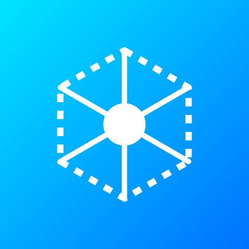

# Tyren AI Assistant

Tyren 是一个**旗舰级**的 AI 对话助手，基于 Next.js 15 和 Google Gemini 2.5 构建。它不仅仅是一个聊天框，更是一个经过深度优化、拥有原生 App 级体验的 PWA 应用。



## ✨ 核心亮点

### 🎨 旗舰级 UI/UX 体验
- **沉浸式 PWA**: 已深度优化，强制纯白极简主题，适配 iOS/Android 状态栏，提供原生 App 般的使用感。
- **Mac 风格代码块**: 代码显示区域采用 macOS 风格设计（红黄绿窗口控制），支持语法高亮与一键复制。
- **智能排版系统**: 
  - **实时流式渲染**: 告别打字机延迟，所见即所得的极速响应。
  - **Markdown 自动纠错**: 内置智能预处理器，自动修复 AI 输出的毁坏格式（如错误的加粗空格），确保排版始终完美。
  - **精美表格**: 隔行变色的斑马纹表格，数据清晰易读。
  - **KaTeX 数学支持**: 完美渲染复杂的数学公式与科学符号。

### 🧠 强大的 AI 能力
- **双模态输入**: 支持文本对话与**图片视觉分析**（自动压缩优化，节省 Token）。
- **Google 联网搜索**: 内置 Grounding 服务，AI 可实时访问最新网络信息，并在回答中通过角标引用来源。
- **长时记忆**: 智能滑动窗口机制，支持长时间的连续对话。

### 🛡️ 工业级稳定性
- **抗网络抖动流式传输**: 独家研发的 Buffer 缓冲算法，彻底解决移动端弱网环境下（如 4G/5G 切换）导致的 JSON 解析失败或丢字问题。
- **安全鉴权**: 简单的口令访问保护，防止私有部署被滥用。

## 🛠️ 部署指南 (Vercel)

本项目专为 Vercel 均 Serverless 环境优化：

1. **Fork** 本仓库。
2. 在 Vercel 导入项目。
3. 配置环境变量：

| 变量名 | 必填 | 描述 | 示例 |
| :--- | :--- | :--- | :--- |
| `GEMINI_API_KEY` | ✅ | Google AI Studio 获取的 API 密钥 | `AIzaSy...` |
| `WEB_ACCESS_PASSWORD` | ✅ | 网页访问密码（防止未授权使用） | `your_secret_password` |
| `GEMINI_MODEL` | ❌ | 指定模型版本 (默认会自动使用稳定版) | `gemini-2.5-flash` |

## 💻 本地开发

```bash
# 1. 安装依赖
npm install

# 2. 启动开发服务器
npm run dev
```

访问 `http://localhost:3000` 即可体验。

## 📱 PWA 安装说明

1. **iOS (Safari)**: 点击底部 "分享" 按钮 -> "添加到主屏幕"。
2. **Android (Chrome)**: 点击右上角菜单 -> "添加到主屏幕"。
3. **PC (Chrome/Edge)**: 点击地址栏右侧的安装图标。

---
*Built with Next.js 15, React 19, & Google Generative AI*
